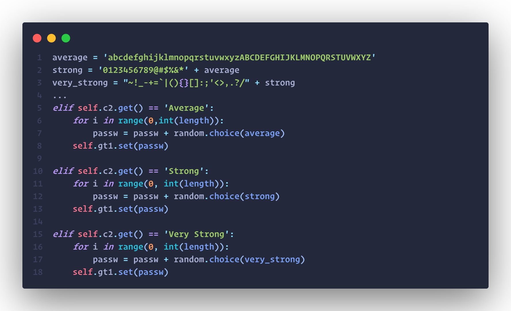
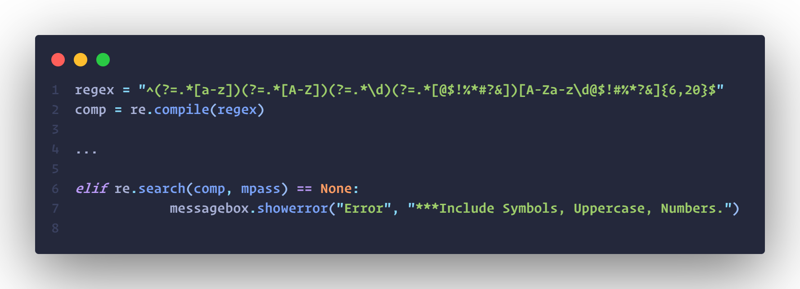
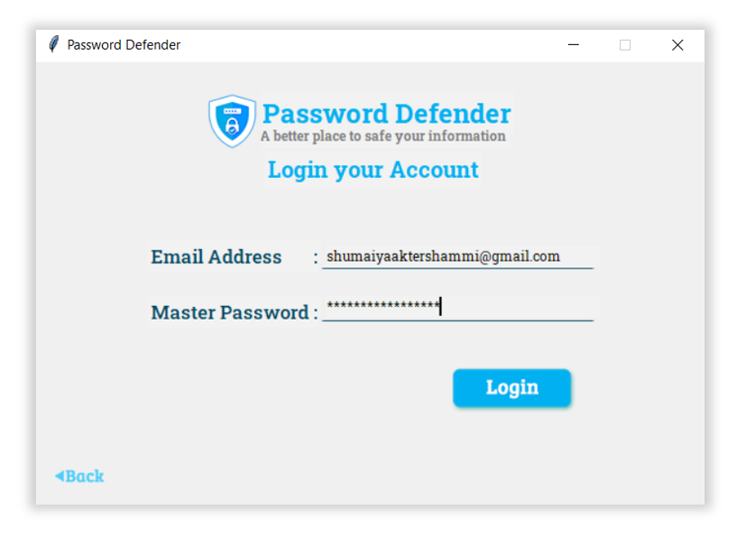
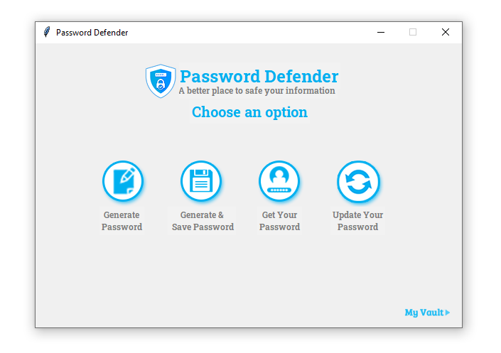
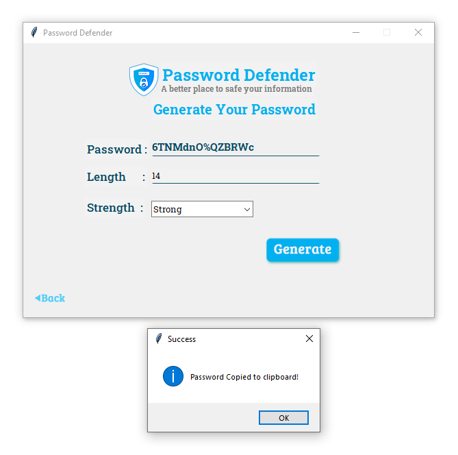
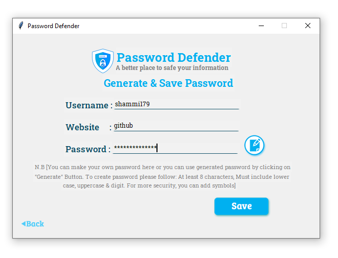
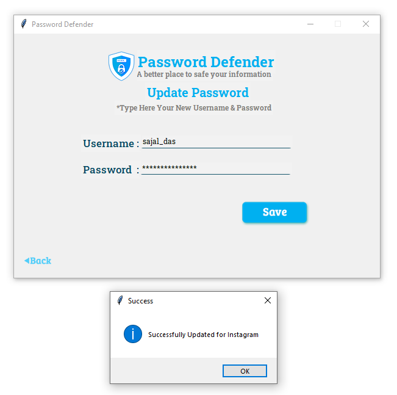
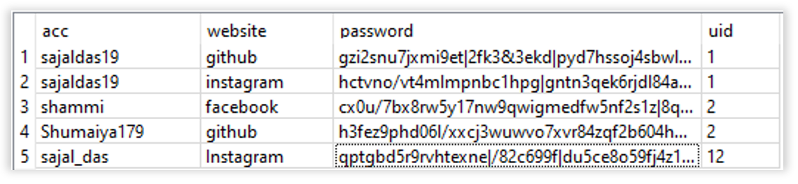

<h1 align="center"><b>Password Defender </h1>
(A password generator and storage application)

## About Project

In this project, we have implemented a password generator and password defender. To use this application, a user must have to create an account where he/she has to give an email address and set a Master Password and in future the user has to login with this master password to do perform any action. we have implemented a password generator which has 3 categories (Average, Strong, Very Strong). For more safety and security, we should use the very strong option as well as a length of at least 16 characters. In this system, a user can save his/her other passwords as well as any new passwords and generate them easily and for this they have to save this password using website and username so that he can get this password by using website name. A user can easily update his/her password verifying Master Password.

Algorithm for generating password

Code for regex

### **Sign Up** If a user is new to our application, he/she must have to create an account to perform any action. First user has to register for his/her own password manager in Password Defender. For that must fill-up his/her – Email Address, give a strong Master Password and Confirm the Master Password. We store this Master Password in our database in encrypted way which is our SSD Encryption Method.

Sign Up

### **Login** After completing the step "Register", the login page will be visible. Or if a user already has an account in our Password Defender Application, then the user does not need to register again. He/she just has to click on the login button and login to his/her account.

Login

### **Features** There are 4 options in our program – Generate Password, Generate & Save Password, Get Your Password and Update Password.

Menu

### **Generate and Save Password** It’s the principal option of our Password Defender to save user’s password in his/her Password manager. User has to type his/her username of the website, website name and the Password. User can put a custom password or also can generate a password to save.

Generate Password

Save Password

### **Update Password** User can type the website name which he/she want to update, if this name already exists in the database then user has to verify with his/her master password and after a valid input he/she has to put the new username and password for this account, here if he/she click on the save button, we will delete the previous data from the database and insert the new one.

Update Password

Database View

<!-- * A **Student** can view his/her result, courses, teachers, library information etc. 
And a student can change his/her personal information such as phone number address etc. 

Teacher Panel
 -->

#### This Project is made using Python - Tkinter and SQL Database (SQLite).

## Team - Dynamic DUO
  * [Shumaiya Akter Shammi](https://github.com/Shammi179) 
  * [Sajal Das](https://github.com/sajaldas19)  
